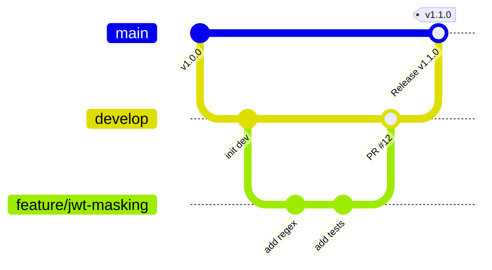

# Contributing to KryptonMCP

Thank you for your interest in contributing to **KryptonMCP**! As an open-source, enterprise-grade security gateway, we maintain high standards for code quality, security, and Git discipline.

---

## 🌳 Branching Strategy (GitFlow)

We follow a structured branching model to protect production stability:



### 1. `main` (Production Branch)
- **Protected Branch**. Direct pushes and force pushes are strictly disabled.
- Contains stable, tagged releases only.
- Merges into `main` happen exclusively via Pull Requests from `develop` during release cycles.

### 2. `develop` (Integration Branch)
- **Protected Branch**. Direct pushes are restricted.
- Active integration branch for all new features and bug fixes.
- All feature PRs must target `develop`.

### 3. Topic Branches (`feature/*`, `fix/*`, `chore/*`, `docs/*`)
- Fork or branch off from `develop`.
- Name your branch descriptively:
  - `feature/add-aws-secrets-driver`
  - `fix/merkle-root-race-condition`
  - `docs/update-cursor-setup`

---

## 🛠️ Contribution Workflow

1. **Fork & Clone**:
   ```bash
   git clone https://github.com/<your-username>/krypton-mcp.git
   cd krypton-mcp
   git checkout develop
   ```

2. **Create a Topic Branch**:
   ```bash
   git checkout -b feature/my-feature-name
   ```

3. **Develop & Test Locally**:
   - Write clean, idiomatic Go with `CGO_ENABLED=0` compatibility.
   - Run tests with race detection:
     ```bash
     go test -v -race ./...
     ```
   - Ensure benchmark integrity if touching performance-critical paths:
     ```bash
     go test -bench=. ./tests/benchmarks/...
     ```

4. **Follow Conventional Commits**:
   Commit messages must follow the [Conventional Commits](https://www.conventionalcommits.org/) standard:
   - `feat(masker): add deterministic UUID tokenization rule`
   - `fix(guardrails): prevent regex catastrophic backtracking on nested prompt`
   - `docs(readme): add Windsurf IDE setup guide`
   - `test(audit): add concurrent Merkle append race test`

5. **Open a Pull Request**:
   - Target `develop` branch (not `main`).
   - Fill in the PR template with a summary of changes and verification steps.
   - Ensure all CI matrix checks (Ubuntu, macOS, Windows) pass.

---

## 🔒 Security Vulnerability Reporting

If you discover a security vulnerability, **please do NOT open a public GitHub issue**. Instead, review our Security Policy or email `security@krypton-mcp.org` for coordinated disclosure.
